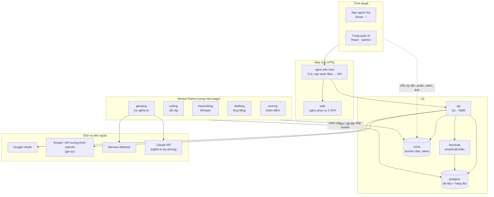
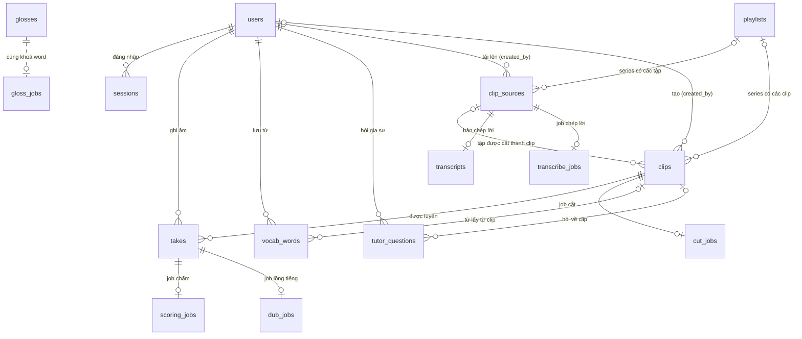
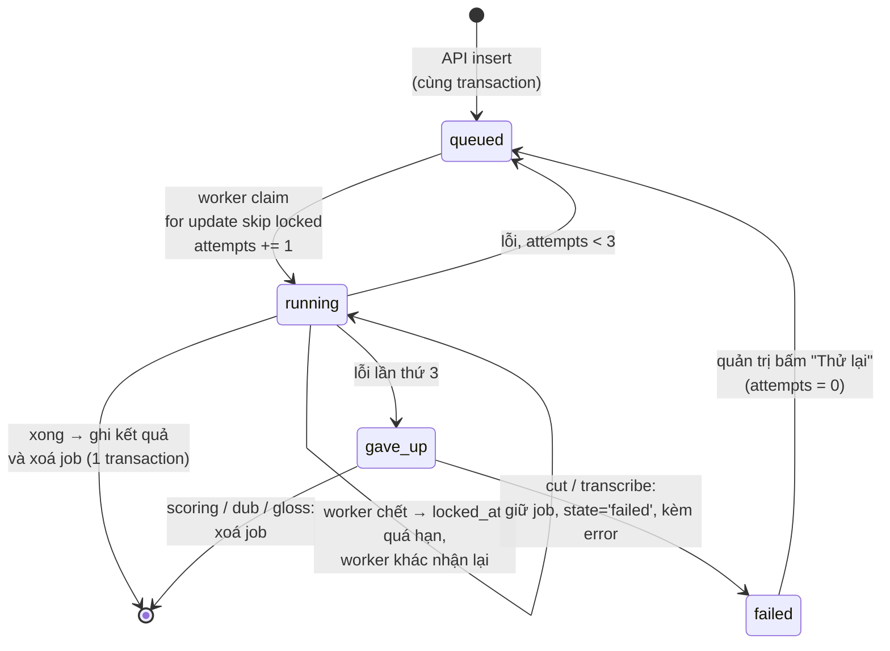
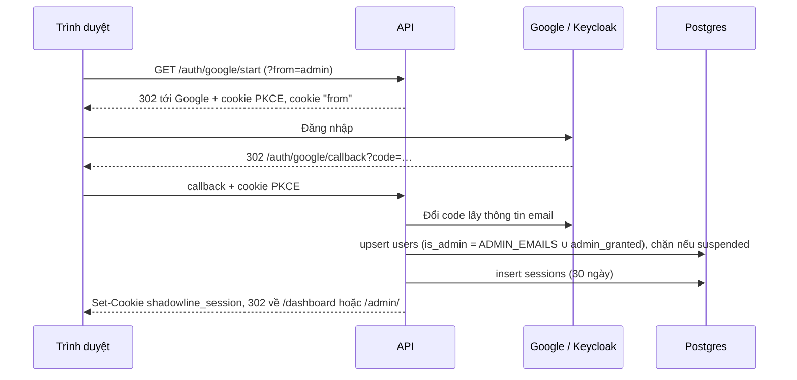
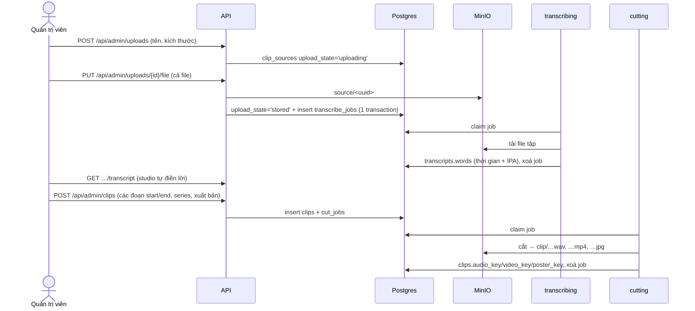
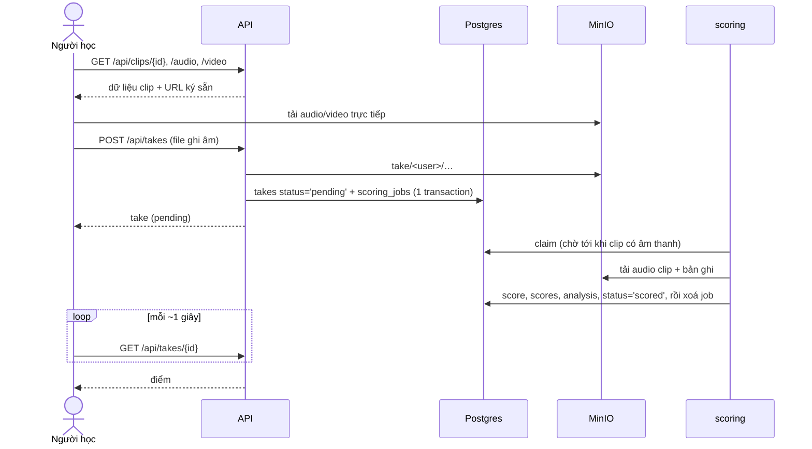
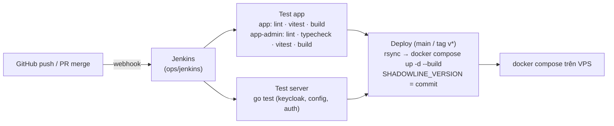

# Kiến trúc hệ thống Shadowline

Tài liệu này mô tả toàn bộ hệ thống: các thành phần, cách chúng nói chuyện với
nhau, cơ sở dữ liệu, hàng đợi công việc, lưu trữ file, xác thực và triển khai.
Nó là bản đồ tổng; lý do chi tiết của từng quyết định nằm trong README của từng
thư mục (xem [mục 15](#15-đọc-thêm)).

> Schema trong [mục 7](#7-cơ-sở-dữ-liệu) được lấy bằng cách chạy toàn bộ
> migration lên một database trống rồi `pg_dump --schema-only`, tính tới
> migration `00018_worker_versions`. Khi thêm migration, hãy cập nhật mục đó.

## Mục lục

1. [Tổng quan](#1-tổng-quan)
2. [Bản đồ repo](#2-bản-đồ-repo)
3. [Sơ đồ thành phần](#3-sơ-đồ-thành-phần)
4. [Các service khi chạy](#4-các-service-khi-chạy)
5. [Hai ứng dụng web](#5-hai-ứng-dụng-web)
6. [API (Go)](#6-api-go)
7. [Cơ sở dữ liệu](#7-cơ-sở-dữ-liệu)
8. [Hàng đợi công việc](#8-hàng-đợi-công-việc)
9. [Các worker (Python)](#9-các-worker-python)
10. [Lưu trữ file](#10-lưu-trữ-file)
11. [Xác thực và phân quyền](#11-xác-thực-và-phân-quyền)
12. [Các luồng chính](#12-các-luồng-chính)
13. [Cấu hình](#13-cấu-hình)
14. [Triển khai, vận hành, kiểm thử](#14-triển-khai-vận-hành-kiểm-thử)
15. [Đọc thêm](#15-đọc-thêm)

---

## 1. Tổng quan

Shadowline là ứng dụng luyện nói tiếng Anh bằng **shadowing**: người học nghe một
câu thoại thật (cắt từ phim, bài giảng…), nói theo ngay, rồi được chấm xem giọng
mình lên xuống, nhấn nhá, giữ nhịp giống bản gốc tới đâu.

Có hai nhóm người dùng:

| Ai | Dùng gì | Làm gì |
| --- | --- | --- |
| **Người học** | App người học (`/`) | Chọn clip trong thư viện, nghe, ghi âm, xem điểm và phân tích, lưu từ vựng, ôn bằng thẻ, nghe bản lồng tiếng, hỏi gia sư AI |
| **Quản trị viên** | Trang quản trị (`/admin/`) | Tải lên bản ghi dài, để máy chép lời, cắt thành clip, xuất bản vào thư viện; quản lý series, người dùng, banner; xem tình trạng hệ thống |

Những việc nặng (chấm điểm, cắt video, chép lời bằng Whisper, lồng tiếng, tra
nghĩa từ) không chạy trong API mà được xếp vào **hàng đợi trong Postgres** và do
các **worker Python** riêng xử lý.

## 2. Bản đồ repo

```
shadowline-english/
├── app/                 App người học — Vite + React + TypeScript (+ toàn bộ e2e Playwright)
├── app-admin/           Trang quản trị — một bản build riêng, phục vụ dưới /admin/
├── server/              API Go (chi, pgx), migration, docker-compose của cả hệ thống
│   ├── cmd/api          main: đọc cấu hình, mở pool, chạy migration, mở HTTP server
│   ├── cmd/seed         Xuất bản thư viện mẫu một lần
│   └── internal/
│       ├── api          Router và handler HTTP
│       ├── auth         Nhà cung cấp OAuth, cookie phiên, ký HMAC
│       ├── config       Mọi biến môi trường, kiểm tra ngay khi khởi động
│       ├── db           Pool + migration nhúng + seed từ điển
│       ├── keycloak     Client Admin API của Keycloak
│       ├── storage      Interface lưu trữ: S3/MinIO hoặc thư mục trên đĩa
│       ├── store        Toàn bộ SQL, viết tay
│       ├── telemetry    OpenTelemetry + /metrics
│       ├── tutor        Client gia sư (OpenAI-compatible) + giới hạn lượt hỏi
│       └── version      Phiên bản code đang chạy
├── scoring/             Các worker Python: chấm điểm, cắt, chép lời, lồng tiếng, tra từ
│   └── shadowline/      worker.py, cutter.py, transcriber.py, dubber.py, glosser.py, *queue.py …
├── ops/
│   ├── nginx/           Cấu hình nginx trong image web
│   ├── jenkins/         Jenkins cho CI/CD trên VPS
│   └── observability/   Grafana LGTM: Alloy, Prometheus, Loki, Tempo, Grafana
├── docs/                Tài liệu vận hành và tài liệu này
├── Jenkinsfile          Pipeline: test app → test server → deploy
└── project/, chats/     Bản thiết kế HTML gốc và hội thoại thiết kế (tham khảo)
```

## 3. Sơ đồ thành phần



Điểm cần nhớ:

- **Một origin.** App người học và trang quản trị được phục vụ cùng một tên
  miền (`/` và `/admin/`). Cookie phiên không có `Domain` và API chỉ cho đúng một
  CORS origin, nên chung origin là thứ làm đăng nhập chạy được ở cả hai.
- **API không xử lý việc nặng.** Nó ghi dòng dữ liệu và job trong **cùng một
  transaction**, rồi trả lời ngay. Worker làm phần còn lại, còn trình duyệt hỏi
  lại (poll) để lấy kết quả.
- **File không đi qua API** khi dùng MinIO/S3: trình duyệt tải audio/video bằng
  URL ký sẵn (presigned). API chỉ nhận file tải lên.
- **Postgres là hàng đợi.** Không có Kafka hay Redis; lý do ở
  [mục 8](#8-hàng-đợi-công-việc).

## 4. Các service khi chạy

Toàn bộ nằm trong [`server/docker-compose.yml`](../server/docker-compose.yml), chung
mạng Docker tên `shadowline` (dùng chung với `ops/observability` và `ops/jenkins`).

| Service | Image / build | Cổng | Vai trò |
| --- | --- | --- | --- |
| `postgres` | `postgres:16-alpine` | 5432 | Dữ liệu ứng dụng, 5 hàng đợi job, và database `keycloak` |
| `minio` | `minio/minio` | 9000 (API), 9001 (console) | Lưu file: bucket `clips` và `takes` |
| `keycloak` | `keycloak:26.0` | 8081 | Đăng ký / đăng nhập bằng email + mật khẩu, quên mật khẩu |
| `mailhog` | `mailhog` | 1025 (SMTP), 8025 (web) | Nhận thư đặt lại mật khẩu khi chạy local |
| `api` | `server/Dockerfile` | 8080 | API Go; tự chạy migration lúc khởi động |
| `web` | `app/Dockerfile` | 8088 | nginx phục vụ 2 bản build SPA (`/` và `/admin/`) |
| `seed` | `server/Dockerfile`, entrypoint `seed` | — | Xuất bản thư viện mẫu một lần rồi thoát |
| `scoring` | `scoring/Dockerfile` | — | `python -m shadowline.worker` — chấm điểm bản ghi |
| `cutting` | cùng image | — | `shadowline.cutter` — cắt audio/video/ảnh bìa cho clip |
| `transcribing` | cùng image | — | `shadowline.transcriber` — Whisper chép lời bản tải lên |
| `dubbing` | cùng image | — | `shadowline.dubber` — ghép giọng người học lên hình clip |
| `glossing` | cùng image | — | `shadowline.glosser` — tra phát âm và nghĩa của từ |

Năm worker dùng **chung một image**, khác entrypoint. Chúng tách thành service
riêng vì mỗi loại việc có người chờ khác nhau: người học chờ điểm vài giây,
không ai ngồi chờ một lần cắt, còn quản trị viên theo dõi bản chép lời trong vài
phút. Chung một worker thì một loạt lần cắt sẽ chắn trước điểm số có người đang
chờ. Mỗi worker có thể tăng số bản sao (`deploy.replicas`) độc lập.

## 5. Hai ứng dụng web

Cả hai đều là Vite + React 19 + TypeScript, không dùng thư viện state ngoài;
chữ hiển thị đi qua hệ i18n riêng (`en`, `vi`), và bộ test `i18n.test.ts` bắt
buộc hai ngôn ngữ có cùng khoá.

### App người học (`app/`)

| Đường dẫn | Màn hình |
| --- | --- |
| `/login` | Đăng nhập (Google, email + mật khẩu qua Keycloak) |
| `/dashboard` | Tổng quan: thẻ "Bắt đầu" cho người mới, số liệu, clip nổi bật, bảng xếp hạng |
| `/library`, `/library/s/:slug`, `/library/e/:episodeId` | Thư viện dạng cây: series → tập → clip; tìm kiếm |
| `/library/:videoId/practice` | Luyện: nghe, ghi âm, dải sóng so sánh, điểm |
| `/library/:videoId` | Phân tích chi tiết một bản ghi |
| `/library/:videoId/dub` | Nghe bản lồng tiếng (giọng mình trên hình clip) |
| `/vocabulary`, `/vocabulary/practice` | Từ vựng đã lưu, ôn bằng thẻ (lặp lại ngắt quãng) |
| `/progress` | Tiến độ theo thời gian, câu yếu nhất |
| `/guide` | Hướng dẫn sử dụng |
| `/profile` | Hồ sơ, ngôn ngữ, giao diện sáng/tối, xuất dữ liệu, xoá tài khoản |

Các phần xuyên suốt: `AppShell` (menu), `TutorChat` (gia sư, chỉ hiện khi server
có `TUTOR_API_KEY`), `TourProvider` (hướng dẫn tương tác cho người mới, trong
`src/tour/`). Dữ liệu người học (bản ghi, từ vựng, hồ sơ) nằm trong
`store/AppStore.tsx`; clip được tải theo từng màn hình chứ không giữ cả thư viện.

### Trang quản trị (`app-admin/`)

Một bản build riêng với `base: '/admin/'`, có trang đăng nhập riêng
(`/admin/login`). Các mục: cắt clip (studio), clip, series, lịch sử tải lên, gia
sư (mức dùng), người dùng, banner, **Hệ thống** (phiên bản code của từng thành
phần và worker nào đang chạy).

Khi phát triển local, dev server của app người học (5173) chuyển `/admin` sang dev
server của trang quản trị (5174), và cả hai chuyển `/api`, `/auth`, `/files` sang
API.

## 6. API (Go)

- **Thư viện:** `chi` cho router, `pgx` cho Postgres, SQL viết tay trong
  `internal/store`.
- **Middleware:** RequestID, RealIP, Recoverer, CORS (đúng một origin
  `APP_ORIGIN`), nạp phiên từ cookie, rồi `requireUser` / `requireAdmin` theo nhóm.
- **Hai hạn giờ:** `requestTimeout` 1 phút cho mọi route; `transferTimeout`
  30 phút cho các route chuyển cả file (tải bản ghi dài lên, `/files/*`);
  `streamTimeout` riêng cho luồng trả lời của gia sư.
- **Migration** nằm trong `internal/db/migrations`, nhúng vào binary, chạy khi API
  khởi động; tên đã chạy (kèm `.sql`) ghi vào bảng `schema_migrations`.
- **Quan sát:** `/healthz`, `/metrics` (Prometheus), trace và log qua
  OpenTelemetry khi có `OTEL_EXPORTER_OTLP_ENDPOINT`.

### Danh sách route

**Công khai**

| Method | Đường dẫn | Việc |
| --- | --- | --- |
| GET | `/healthz` | Kiểm tra sống |
| GET | `/metrics` | Số liệu Prometheus |
| GET | `/files/{bucket}/*` | Phục vụ file khi dùng `DISK_ROOT`, có chữ ký HMAC và hỗ trợ range |
| POST | `/test/reset`, `/test/transcript`, `/test/transcript/fail` | **Chỉ khi `AUTH_FAKE=1`** — dùng cho e2e |

**Xác thực (`/auth`)**

| Method | Đường dẫn | Việc |
| --- | --- | --- |
| GET | `/auth/google/start`, `/auth/google/callback` | Đăng nhập Google (OAuth + PKCE); `?from=admin` quay về trang quản trị |
| GET | `/auth/keycloak/start`, `/auth/keycloak/callback`, `/auth/keycloak/forgot` | Đăng nhập / quên mật khẩu qua trang của Keycloak |
| POST | `/auth/login`, `/auth/register`, `/auth/forgot` | Email + mật khẩu ngay trong app |
| GET | `/auth/me` | Người đang đăng nhập |
| POST | `/auth/logout` | Đăng xuất |

**Người học (`/api`, cần đăng nhập)**

| Nhóm | Route |
| --- | --- |
| Thư viện | `GET /playlists`, `GET /playlists/{slug}`, `GET /episodes/{id}`, `GET /library/search`, `GET /library/summary` |
| Clip | `GET /clips`, `GET /clips/featured`, `GET /clips/next-up`, `GET /clips/{id}`, `GET /clips/{id}/audio`, `GET /clips/{id}/video` |
| Bản ghi | `GET /takes`, `POST /takes`, `GET /takes/{id}`, `GET /takes/{id}/audio`, `DELETE /takes/{id}` |
| Lồng tiếng | `POST /takes/{id}/dub` (xếp job), `GET /takes/{id}/dub` |
| Tra từ | `POST /words/{word}` (tra hoặc xếp job), `GET /words/{word}` |
| Từ vựng | `GET /vocab`, `POST /vocab`, `PATCH /vocab/{id}`, `DELETE /vocab/{id}` |
| Hồ sơ | `GET /profile`, `PATCH /profile`, `PUT /profile/avatar` |
| Tài khoản | `GET /account/export`, `POST /account/password`, `DELETE /account` |
| Khác | `GET /leaderboard`, `GET /banners`, `GET /tutor`, `POST /tutor/chat` (stream) |

**Quản trị (`/api/admin`, cần quyền admin)**

| Nhóm | Route |
| --- | --- |
| Tải lên | `GET /admin/uploads`, `POST /admin/uploads`, `PUT /admin/uploads/{id}/file`, `GET /admin/uploads/{id}`, `POST /admin/uploads/{id}/retry`, `GET /admin/uploads/{id}/transcript` |
| Clip | `GET /admin/clips`, `GET /admin/clips/next-number`, `POST /admin/clips`, `PATCH /admin/clips/{id}`, `PUT /admin/clips/{id}/audio`, `DELETE /admin/clips/{id}` |
| Series / tập | `PATCH /admin/playlists/{id}`, `DELETE /admin/playlists/{id}`, `PATCH /admin/episodes/{id}`, `DELETE /admin/episodes/{id}` |
| Người dùng | `GET /admin/users`, `PATCH /admin/users/{id}` |
| Banner | `GET/POST /admin/banners`, `PUT/DELETE /admin/banners/{id}`, `PUT/DELETE /admin/banners/{id}/image` |
| Hệ thống | `GET /admin/services` (phiên bản + heartbeat worker), `GET /admin/tutor/usage` |

## 7. Cơ sở dữ liệu

PostgreSQL 16, extension `pgcrypto` (UUID) và `pg_trgm` (tìm kiếm mờ). Có
**18 bảng**: 12 bảng dữ liệu, 5 bảng hàng đợi, 1 bảng migration.

### 7.1 Sơ đồ quan hệ



Bảng không có khoá ngoại: `glosses`, `gloss_jobs` (khoá theo `word`), `banners`,
`worker_heartbeats`, `schema_migrations`.

**Khi xoá:** xoá user thì xoá theo phiên, bản ghi, từ vựng, lượt hỏi gia sư
(`CASCADE`); clip và tập họ tạo chỉ mất `created_by` (`SET NULL`). Xoá clip thì
xoá theo bản ghi và job cắt; từ vựng và lượt hỏi gia sư chỉ mất `clip_id`. Xoá
series thì clip và tập chỉ mất `playlist_id`. File trong MinIO do API dọn riêng
(`dropObjects`), không do database.

### 7.2 Thư viện: series → tập → clip

Ba tầng thư viện tương ứng ba bảng: **series** = `playlists`, **tập** =
`clip_sources` (một bản ghi dài được tải lên), **clip** = `clips` (một câu cắt từ tập).

**`playlists`** — series (Friends, một khoá bài giảng…)

| Cột | Kiểu | Ghi chú |
| --- | --- | --- |
| `id` | uuid PK | |
| `slug` | text, unique | Dùng trong URL `/library/s/:slug` |
| `title` | text | Unique không phân biệt hoa thường (`lower(title)`) |
| `description` | text | |
| `hot` | boolean | Gắn nhãn "hot" trong thư viện |
| `position` | int | Thứ tự hiển thị |
| `created_at` | timestamptz | |

**`clip_sources`** — tập / bản ghi gốc được tải lên

| Cột | Kiểu | Ghi chú |
| --- | --- | --- |
| `id` | uuid PK | |
| `key` | text | Khoá file trong bucket `clips` (`source/…`) |
| `name`, `title` | text | Tên file gốc; tên tập hiển thị |
| `content_type`, `bytes`, `duration_seconds` | | Thông tin file |
| `has_video` | boolean | Có hình hay chỉ tiếng |
| `playlist_id` | uuid FK → playlists | Series chứa tập (`SET NULL`) |
| `position` | int | Thứ tự trong series |
| `published` | boolean | Đã xuất bản vào thư viện chưa |
| `upload_state` | text | `uploading` \| `stored` \| `failed` |
| `error` | text | Lý do khi tải lên thất bại |
| `created_by` | uuid FK → users | `SET NULL` |

Trạng thái hiển thị trong "Lịch sử tải lên" (`uploading`, `transcribing`,
`ready`, `cutting`, `done`, các trạng thái lỗi…) **không lưu thành cột** mà được
đọc ra từ `upload_state`, job và kết quả hiện có. Lý do ở `server/README.md`,
mục "Uploading is two requests".

**`transcripts`** — lời Whisper nghe được trong một tập

| Cột | Kiểu | Ghi chú |
| --- | --- | --- |
| `source_id` | uuid PK, FK → clip_sources | `CASCADE` |
| `words` | jsonb | `[{ "start": 1.2, "end": 1.5, "text": "have", "ipa": "hæv" }, …]` |
| `language` | text | Ngôn ngữ Whisper nhận ra |

**`clips`** — một câu để luyện

| Cột | Kiểu | Ghi chú |
| --- | --- | --- |
| `id` | uuid PK | |
| `title`, `summary`, `timestamp_label` | text | |
| `source` / `playlist` | text | Tên nguồn / series dạng chữ (dữ liệu cũ, trước khi có bảng `playlists`) |
| `playlist_id` | uuid FK → playlists | `SET NULL` |
| `source_id` | uuid FK → clip_sources | Tập được cắt ra (`SET NULL`) |
| `start_seconds`, `end_seconds`, `duration_seconds` | float | Đoạn cắt trong tập |
| `captions` | jsonb | `[{ "text": "I have an idea.", "ipa": "/aɪ hæv…/" }, …]`, mỗi phần tử là một câu |
| `categories` | text[] | Chủ đề (interview, news, song…) |
| `featured` | boolean | Hiện ở "Clip nổi bật" trên Tổng quan |
| `audio_key` | text | Âm thanh để chấm (`clip/…wav`), do máy cắt tạo |
| `video_key` | text | Video đã cắt (`clip/…mp4`) |
| `poster_key` | text | Ảnh bìa (`clip/…jpg`) |
| `created_by`, `created_at` | | |

Chỉ mục: trigram trên `title` và `captions::text` (tìm kiếm), `featured`, theo
`playlist_id` / `source_id`, và `clips_playlist_cover_idx` để lấy ảnh bìa series.

### 7.3 Người dùng và phiên

**`users`**

| Cột | Kiểu | Ghi chú |
| --- | --- | --- |
| `id` | uuid PK | |
| `email` | text, unique | Danh tính chung cho Google và Keycloak |
| `name`, `avatar_key` | | Ảnh đại diện ở `avatar/…` trong bucket `clips` |
| `is_admin` | boolean | Tính lại mỗi lần đăng nhập: email nằm trong `ADMIN_EMAILS` **hoặc** `admin_granted` |
| `admin_granted` | boolean | Quyền admin cấp trong trang quản trị |
| `suspended_at` | timestamptz | Khác null = bị khoá, không đăng nhập được |
| `last_signed_in_at`, `created_at` | timestamptz | |

**`sessions`**: `id` (text PK, giá trị ngẫu nhiên trong cookie `shadowline_session`),
`user_id` (FK, `CASCADE`), `expires_at` (30 ngày), `created_at`.

### 7.4 Luyện tập

**`takes`** — một lần ghi âm của người học

| Cột | Kiểu | Ghi chú |
| --- | --- | --- |
| `id` | uuid PK | |
| `user_id` | uuid FK → users | `CASCADE` |
| `clip_id` | uuid FK → clips | `CASCADE` |
| `audio_key` | text | Bản ghi ở `take/…` trong bucket `takes` |
| `status` | enum `take_status` | `pending` → `scored` hoặc `failed` |
| `score` | float | Điểm tổng 0–100, null nếu không chấm được |
| `scores` | jsonb | Điểm thành phần: `Intonation`, `Rhythm`, `Stress`, `Variation` |
| `analysis` | jsonb | Đường cao độ, đường độ lớn, các từ Whisper nghe được… cho màn hình Phân tích |
| `error` | text | Lý do không chấm được |
| `dub_key` | text | Video lồng tiếng (`dub/…mp4`, bucket `takes`) |
| `recorded_at` | timestamptz | |

Bảng xếp hạng, số liệu Tổng quan và Tiến độ đều **tính từ `takes`**, không có
bảng riêng.

**`vocab_words`** — từ người học lưu, kèm lịch ôn

| Cột | Kiểu | Ghi chú |
| --- | --- | --- |
| `id` | uuid PK | unique (`user_id`, `word`) |
| `user_id` | uuid FK | `CASCADE` |
| `word`, `ipa`, `meaning` | text | |
| `status` | text | `new` \| `learning` \| `known` |
| `clip_id` | uuid FK → clips | Clip từ đó được lưu (`SET NULL`) |
| `interval_days`, `due_at`, `reviewed_at` | | Lặp lại ngắt quãng: `due_at` là ngày đến hạn ôn |

**`glosses`** — bộ nhớ đệm nghĩa từ, dùng chung cho mọi người (mỗi từ tra một lần)

| Cột | Kiểu | Ghi chú |
| --- | --- | --- |
| `word` | text PK | Dạng chuẩn hoá |
| `ipa` | text | Từ CMUdict |
| `meaning` | text | Từ Merriam-Webster, hoặc Claude khi từ điển không có |
| `source` | text | Nguồn của nghĩa |

Khi migrate, `internal/db/seed_freetalk.go` nạp sẵn một danh sách từ vào đây.

### 7.5 Gia sư, banner, vận hành

**`tutor_questions`** — mỗi câu hỏi gửi gia sư, dùng để giới hạn lượt và thống kê

| Cột | Kiểu | Ghi chú |
| --- | --- | --- |
| `id` | bigint PK | |
| `user_id` | uuid FK | `CASCADE` |
| `clip_id` | uuid FK | Clip đang luyện khi hỏi (`SET NULL`) |
| `model` | text | Model đã dùng |
| `outcome` | text | `asked` \| `answered` \| `stopped` \| `failed` |
| `prompt_tokens`, `completion_tokens` | int | |
| `asked_at`, `answered_at` | timestamptz | |

Giới hạn mặc định: **30 câu mỗi 10 phút** cho một người (`cmd/api/main.go`).

**`banners`** — thông báo trên Tổng quan hoặc Thư viện

| Cột | Ghi chú |
| --- | --- |
| `title`, `body`, `link_url`, `link_label`, `image_key` | Nội dung; ảnh ở `banner/…` trong bucket `clips` |
| `placement` | `dashboard` \| `library` |
| `locale` | Rỗng = mọi ngôn ngữ |
| `starts_at`, `ends_at`, `enabled`, `position` | Lịch hiển thị (ràng buộc `ends_at > starts_at`) và thứ tự |

**`worker_heartbeats`** — mỗi worker báo "còn sống" 10 giây một lần

| Cột | Ghi chú |
| --- | --- |
| `service` | PK: `transcribing`, `cutting`, `scoring`, `dubbing`, `glossing` |
| `seen_at`, `busy` | Lần báo gần nhất; có đang làm việc không. Coi là đang chạy nếu báo trong 45 giây |
| `version`, `started_at` | Phiên bản code và lúc khởi động, cho trang **Hệ thống** |

**`schema_migrations`**: `name` (PK, gồm cả `.sql`), `applied_at`.

### 7.6 Lịch sử migration

| File | Nội dung |
| --- | --- |
| `00001_init` | users, clips, takes (+ enum), sessions, vocab_words, scoring_jobs |
| `00002_clip_video` | clip_sources, cut_jobs, cột video của clips |
| `00003_transcripts` | transcripts, transcribe_jobs, `clip_sources.has_video` |
| `00004_clip_poster` | `clips.poster_key` |
| `00005_take_dub` | dub_jobs, `takes.dub_key` |
| `00006_glosses`, `00007_gloss_source` | glosses, gloss_jobs, `glosses.source` |
| `00009_library` | playlists; `playlist_id`, `title`, `position`, `published` cho tập; extension `pg_trgm` và chỉ mục tìm kiếm |
| `00010_vocab_schedule` | lịch ôn: `interval_days`, `due_at` |
| `00011_uploads` | `upload_state`, `bytes`, `duration_seconds`, `error` trên clip_sources |
| `00012_tutor_questions` | tutor_questions |
| `00013_user_access` | `admin_granted`, `suspended_at`, `last_signed_in_at` |
| `00014_banners` | banners |
| `00015_library_indexes` | `clips_playlist_cover_idx`, `takes_recorded_idx` |
| `00016_transcriber_status` | worker_heartbeats |
| `00017_requeue_missing_sound` | Chỉ sửa dữ liệu: xếp lại việc cắt cho clip thiếu âm thanh |
| `00018_worker_versions` | `version`, `started_at` trong worker_heartbeats |

Số `00008` bị bỏ trống, không phải thiếu file. Việc giữ lại job cắt / chép lời
thất bại (`state='failed'`) nằm trong code worker và API, không cần migration vì
cột `state` vốn là `text`.

## 8. Hàng đợi công việc

### 8.1 Vì sao dùng bảng Postgres

Mỗi bản ghi của người học sinh ra đúng một job. Giới hạn thật nằm ở CPU Python
(chấm một bản ghi mất khoảng một giây), không ở thông lượng tin nhắn, nên Kafka
hay Redis không giúp gì. Bảng còn cho hai thứ mà message broker không cho:

1. Job được ghi **trong cùng transaction** với dữ liệu sinh ra nó. Không có lúc
   nào một bản ghi tồn tại mà không có job chấm nó.
2. Không thêm hạ tầng phải vận hành.

### 8.2 Cách một job chạy (chung cho 5 hàng đợi)



- Mọi bảng job có cùng cột: `id`, khoá của việc cần làm (unique),
  `state`, `attempts`, `locked_at`, `error`, `created_at`, và chỉ mục một phần
  `WHERE state = 'queued'`.
- Worker nhận job bằng `select … for update skip locked`, nên nhiều bản sao có
  thể cùng đọc một bảng mà không chặn nhau hay nhận trùng job.
- Job `running` có `locked_at` quá hạn được coi như của một worker đã chết, và
  worker khác được nhận lại.
- Mỗi job được thử tối đa **3 lần**.

| Bảng | Khoá unique | Ai tạo | Worker | Coi là chết sau | Khi bỏ cuộc |
| --- | --- | --- | --- | --- | --- |
| `scoring_jobs` | `take_id` | `POST /api/takes` | `scoring` | 5 phút | Xoá job; take `status='failed'` kèm `error` |
| `cut_jobs` | `clip_id` | `POST /api/admin/clips` (xuất bản) | `cutting` | 20 phút | **Giữ** job `state='failed'`; quản trị viên bấm thử lại được |
| `transcribe_jobs` | `source_id` | `PUT /api/admin/uploads/{id}/file` (khi file đã lưu) | `transcribing` | 90 phút | **Giữ** job `state='failed'`; thử lại được |
| `dub_jobs` | `take_id` | `POST /api/takes/{id}/dub` | `dubbing` | 5 phút | Xoá job |
| `gloss_jobs` | `word` | `POST /api/words/{word}` khi từ chưa có trong `glosses` | `glossing` | 1 phút | Xoá job; từ giữ nghĩa rỗng |

Mọi truy vấn kiểu "còn việc đang chờ không" đều loại job `failed` ra
(`state <> 'failed'`). Nếu không, một job đã bỏ cuộc sẽ khiến màn hình chờ mãi.

Để theo dõi tải: `select count(*) from scoring_jobs where state = 'queued'`. Nếu
con số này cứ tăng thì thêm bản sao worker.

## 9. Các worker (Python)

Tất cả nằm trong `scoring/shadowline/`, dùng chung `storage.py` (MinIO hoặc thư
mục đĩa), `telemetry.py` và `heartbeat.py`. Một vòng lặp mẫu: kết nối DB → claim
→ làm việc → complete/fail. Khi mất DB, worker chờ rồi kết nối lại chứ không
thoát.

| Worker | Đọc | Ghi | Công cụ |
| --- | --- | --- | --- |
| `worker.py` (scoring) | Audio clip (`clips`), bản ghi (`takes`) | `takes.score/scores/analysis/status` | Theo dõi cao độ, DTW; Whisper kiểm tra người học có nói đúng từ (`WORD_CHECK`) |
| `cutter.py` | File tập (`source/…`) | `clip/…wav`, `clip/…mp4`, `clip/…jpg` → `clips.audio_key/video_key/poster_key` | ffmpeg |
| `transcriber.py` | File tập | `transcripts.words` (có thời gian và IPA) | faster-whisper (`WHISPER_MODEL`), CMUdict cho IPA |
| `dubber.py` | Video clip + bản ghi | `dub/…mp4` → `takes.dub_key` | ffmpeg |
| `glosser.py` | — | `glosses` | CMUdict (phát âm), Merriam-Webster (`DICTIONARY_API_KEY`), Claude (`ANTHROPIC_API_KEY`) |

Bốn điểm thành phần (chi tiết ở `scoring/README.md`):

- **Intonation:** khoảng cách trung bình tính bằng bán cung giữa hai đường cao độ.
- **Rhythm:** đường căn chỉnh lệch khỏi đường chéo bao nhiêu, và độ dài hai câu
  giống nhau tới đâu.
- **Stress:** tương quan giữa hai đường độ lớn.
- **Variation:** tỉ lệ giữa hai biên độ cao độ.

Cao độ được tính quanh trung vị giọng của chính mỗi người, nên giọng trầm nhại
giọng cao vẫn được chấm công bằng.

## 10. Lưu trữ file

Hai bucket (tên đặt bằng `S3_CLIPS_BUCKET`, `S3_TAKES_BUCKET`):

| Bucket | Tiền tố khoá | Nội dung | Ai ghi |
| --- | --- | --- | --- |
| `clips` | `source/<uuid>.<ext>` | Bản ghi dài quản trị viên tải lên | API |
| `clips` | `clip/<clip_id>/<uuid>.wav` / `.mp4` / `.jpg` | Âm thanh, video, ảnh bìa của clip | Worker cắt (hoặc API khi tải audio tay) |
| `clips` | `avatar/<user_id>…` | Ảnh đại diện | API |
| `clips` | `banner/<banner_id>/<uuid>.<ext>` | Ảnh banner | API |
| `takes` | `take/<user_id>…` | Bản ghi của người học | API |
| `takes` | `dub/<take_id>/<uuid>.mp4` | Video lồng tiếng | Worker lồng tiếng |

Khoá luôn chứa một uuid mới, nên file không bao giờ bị ghi đè tại chỗ và cache
không bao giờ trả bản cũ.

Hai chế độ lưu trữ:

- **`S3_ENDPOINT` được đặt (MinIO/S3):** API trả về URL ký sẵn, trình duyệt tải
  thẳng từ MinIO. `S3_PUBLIC_ENDPOINT` là địa chỉ mà trình duyệt nhìn thấy.
  MinIO phải cho phép CORS từ `APP_ORIGIN`.
- **`DISK_ROOT` được đặt:** file nằm trên đĩa, mỗi bucket một thư mục, và API tự
  phục vụ qua `GET /files/{bucket}/*` với chữ ký HMAC (`internal/auth/sign.go`).
  Route này trả đúng `Content-Type` theo đuôi file và hỗ trợ range request, để
  trình duyệt tua được audio/video.

## 11. Xác thực và phân quyền



- **Ba cách đăng nhập:** Google (OAuth + PKCE), Keycloak (email + mật khẩu, quên
  mật khẩu gửi thư qua SMTP), và nhà cung cấp giả khi `AUTH_FAKE=1` (chỉ cho
  test, chọn người dùng bằng `?email=`). Mọi cách đều dẫn tới cùng một dòng
  `users` theo email.
- **Phiên:** phiên lưu phía server trong bảng `sessions`. Cookie
  `shadowline_session` là HttpOnly, SameSite=Lax, Secure khi chạy https, và sống 30 ngày. Đăng xuất thì xoá dòng.
- **Quyền admin:** `requireAdmin` kiểm tra `users.is_admin`. Admin là người có
  email trong `ADMIN_EMAILS`, hoặc được cấp quyền trong trang quản trị.
  Tài khoản bị khoá (`suspended_at`) không đăng nhập được.
- **Đăng nhập từ trang quản trị:** cookie `shadowline_login_from` nhớ lần đăng
  nhập bắt đầu từ `/admin`, để sau đăng nhập (thành công hay lỗi) quay về đúng chỗ.

## 12. Các luồng chính

### 12.1 Từ bản ghi dài tới clip trong thư viện



### 12.2 Người học luyện một câu



Nếu clip không có âm thanh gốc, bản ghi vẫn được lưu nhưng kết thúc ở trạng
thái không có điểm. Sau 3 lần lỗi, take chuyển `failed` kèm lý do, để màn hình
không quay mãi ở "Đang đo…".

### 12.3 Tra từ

1. Chạm một từ gọi `POST /api/words/{word}`.
2. Nếu `glosses` đã có từ đó, API trả lời ngay. Nếu chưa, API xếp `gloss_jobs`,
   rồi app poll `GET /api/words/{word}`.
3. Worker lấy phát âm từ CMUdict, lấy nghĩa từ Merriam-Webster, và nếu từ điển
   không có thì hỏi Claude, dựa vào câu chứa từ đó để chọn đúng nghĩa.
4. Kết quả được lưu dùng chung cho mọi người, nên mỗi từ chỉ tra một lần.

### 12.4 Lồng tiếng

`POST /api/takes/{id}/dub` xếp một `dub_jobs`. Worker ghép bản ghi của người học
lên video clip thành `dub/…mp4`, rồi ghi `takes.dub_key`. Trong lúc đó app poll
`GET /api/takes/{id}/dub`. Màn hình Xem lồng tiếng tự phát video tắt tiếng cùng
giọng người học ngay trong trình duyệt; file mp4 chỉ để tải về.

### 12.5 Gia sư

1. `POST /api/tutor/chat` kiểm tra giới hạn lượt (đếm trong `tutor_questions`).
2. API ghi một dòng `asked`, rồi gọi endpoint tương thích OpenAI (`TUTOR_API_URL`,
   mặc định là 9router, model `TUTOR_MODEL`). Prompt kèm lời thoại thật của clip
   đang luyện.
3. Câu trả lời được stream về trình duyệt.
4. Khi xong, dòng được cập nhật `answered` / `stopped` / `failed` kèm số token.
   Trang quản trị đọc các dòng này ở `GET /api/admin/tutor/usage`.

Nếu `TUTOR_API_KEY` rỗng, `GET /api/tutor` báo tắt và app ẩn khung chat.

### 12.6 Phiên bản và heartbeat

1. Mỗi worker ghi `worker_heartbeats` 10 giây một lần, kèm phiên bản code.
2. API trả phiên bản của chính nó cùng tình trạng các worker qua
   `GET /api/admin/services`.
3. Trang quản trị so phiên bản của mình, của API và của từng worker. Thành phần
   nào khác API hoặc không chạy thì được đánh dấu. Đây là cách phát hiện một
   phần còn chạy code cũ sau khi `git pull`.

Phiên bản lấy theo thứ tự:
1. `SHADOWLINE_VERSION`;
2. commit git (7 ký tự, thêm `-dirty` nếu có sửa đổi chưa commit);
3. `unknown`.

## 13. Cấu hình

Mẫu đầy đủ, có chú thích: [`server/.env.example`](../server/.env.example).
File `.env` không nằm trong git.

**API** (`internal/config`, kiểm tra ngay khi khởi động)

| Biến | Ý nghĩa |
| --- | --- |
| `ADDR` | Địa chỉ lắng nghe (`:8080`) |
| `DATABASE_URL` | Chuỗi kết nối Postgres |
| `SESSION_SECRET` | Khoá ký phiên / HMAC, ít nhất 32 byte ngẫu nhiên |
| `APP_ORIGIN` | Origin của web app: CORS và chuyển hướng sau đăng nhập |
| `ADMIN_EMAILS` | Danh sách email admin, cách nhau bằng dấu phẩy |
| `GOOGLE_CLIENT_ID`, `GOOGLE_CLIENT_SECRET`, `OAUTH_REDIRECT_URL` | Google OAuth |
| `KEYCLOAK_URL`, `KEYCLOAK_PUBLIC_URL`, `KEYCLOAK_REALM`, `KEYCLOAK_CLIENT_ID`, `KEYCLOAK_CLIENT_SECRET`, `KEYCLOAK_REDIRECT_URL`, `KEYCLOAK_ADMIN`, `KEYCLOAK_ADMIN_PASSWORD` | Keycloak. Để trống thì tắt đăng nhập bằng mật khẩu |
| `S3_ENDPOINT`, `S3_PUBLIC_ENDPOINT`, `S3_ACCESS_KEY`, `S3_SECRET_KEY`, `S3_REGION`, `S3_USE_SSL`, `S3_CLIPS_BUCKET`, `S3_TAKES_BUCKET` | MinIO/S3 |
| `DISK_ROOT` | Thay cho S3: lưu file trên đĩa |
| `TUTOR_API_URL`, `TUTOR_API_KEY`, `TUTOR_MODEL` | Gia sư. Để trống khoá thì tắt |
| `AUTH_FAKE` | `1` = nhà cung cấp đăng nhập giả + route `/test/*`. **Chỉ dùng cho test** |
| `OTEL_EXPORTER_OTLP_ENDPOINT`, `OTEL_SERVICE_NAME` | OpenTelemetry |
| `SHADOWLINE_VERSION` | Phiên bản gắn khi build image |

**Worker**

| Biến | Ý nghĩa |
| --- | --- |
| `DATABASE_URL`, `DISK_ROOT` / các biến `S3_*` | Như API |
| `WHISPER_MODEL`, `WHISPER_COMPUTE_TYPE` | Model Whisper cho chép lời và kiểm tra từ |
| `WORD_CHECK` | Bật/tắt kiểm tra "có nói đúng từ" khi chấm |
| `DICTIONARY_API_KEY` | Merriam-Webster Learner's |
| `ANTHROPIC_API_KEY`, `GLOSS_MODEL` | Claude cho những từ từ điển không có |
| `LOG_LEVEL`, `OTEL_*`, `SHADOWLINE_VERSION` | Log, telemetry, phiên bản |

**Frontend:** `VITE_API_URL` (để trống khi app và API chung host). Khi chạy dev:
`ADMIN_API_URL`, `APP_URL`, `ADMIN_PORT`.

## 14. Triển khai, vận hành, kiểm thử

### Triển khai trên VPS



1. **Pipeline** ([`Jenkinsfile`](../Jenkinsfile)) gồm Checkout, Test app, Test
   server, rồi Deploy. CI **chưa** chạy e2e Playwright, `pytest`, hay các test Go
   cần Postgres; chúng chạy khi phát triển (xem bảng Kiểm thử bên dưới).
2. Bước Deploy chỉ chạy trên `main`/`master` hoặc tag `v*`. Nó rsync workspace vào
   thư mục triển khai, giữ nguyên `server/.env`, rồi `docker compose up -d --build`.
   Chi tiết: [`docs/ops-jenkins.md`](ops-jenkins.md).
3. **nginx trên host** lo TLS (file mẫu: `ops/nginx/vhost.example.conf`). Nó
   chuyển `/api/`, `/auth/`, `/files/`, `/healthz` sang API (8080), còn lại sang
   container `web` (8088). Trong container, nginx phục vụ `index.html` của từng
   SPA (`ops/nginx/app.conf`). File mẫu còn có vhost cho Jenkins và Grafana.
4. **Quan sát:** các service gửi trace, log và metric qua OpenTelemetry tới
   Grafana Alloy, rồi tới Tempo, Loki, Prometheus và Grafana. Chi tiết:
   [`docs/ops-observability.md`](ops-observability.md).
5. **Sao lưu:** volume `pgdata` (Postgres, gồm cả dữ liệu Keycloak) và
   `miniodata` (mọi file). Hai volume này là toàn bộ trạng thái của hệ thống.

### Chạy local

```bash
cd server && cp .env.example .env    # điền SESSION_SECRET, Google OAuth…
docker compose up                    # postgres, minio, keycloak, api, 5 worker
cd ../app && yarn && yarn dev        # :5173
cd ../app-admin && npm i && npm run dev   # :5174, vào qua :5173/admin/
```

### Kiểm thử

| Tầng | Công cụ | Ở đâu |
| --- | --- | --- |
| API | `go test ./...` (dùng Postgres thật qua `TEST_DATABASE_URL`) | `server/internal/**/*_test.go` |
| Worker | `pytest` (lưu trữ bằng thư mục, fixture âm thanh) | `scoring/tests/` |
| Frontend | vitest + oxlint + `tsc` | `app/test/`, `app-admin/test/` |
| Đầu-cuối | Playwright chạy cả hệ thống thật, với đăng nhập giả và micro giả; hai project `app` và `console` | `app/e2e/` |

Mọi test e2e mặc định đăng nhập như một trình duyệt đã xem hướng dẫn tương tác.
Riêng `tour.spec.ts` mở tour.

## 15. Đọc thêm

| Tài liệu | Nội dung |
| --- | --- |
| [`server/README.md`](../server/README.md) | Google OAuth, Keycloak, thư viện dạng cây, tải lên, gia sư, bản chép lời, tra từ, lý do hàng đợi là bảng, phục vụ audio, hạn giờ |
| [`scoring/README.md`](../scoring/README.md) | Cách chấm, khớp kết quả với bản chạy trên trình duyệt, giới hạn khi có tiếng ồn, mở rộng quy mô |
| [`app/README.md`](../app/README.md) | Màn hình, menu, ôn thẻ, gia sư, ngôn ngữ, test |
| [`app-admin/README.md`](../app-admin/README.md) | Vì sao là app riêng dưới `/admin/`, studio cắt, lịch sử tải lên |
| [`docs/ops-jenkins.md`](ops-jenkins.md) | Dựng Jenkins và CI/CD trên VPS |
| [`docs/ops-observability.md`](ops-observability.md) | Dựng Grafana LGTM |
